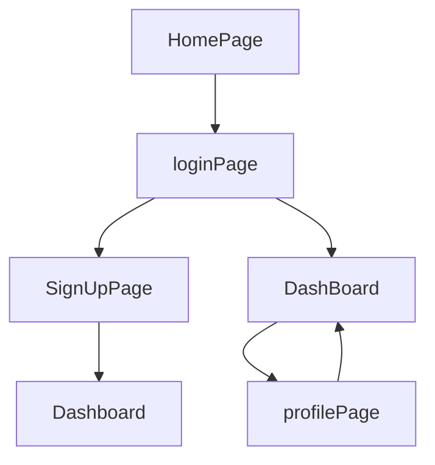

# Todolist backend repo

> Todolist is an task management platform, from here you can create and manage your task. This was an Individual project.

## Teck Stacks

- NodeJS
- ExpressJS
- Mongoose
- MongoDB
- MVC framework
- Json-web-token
- Bcrypt
- Dotenv

## Front-end Repo

## Flow

## Screen shots

## 🔗 Collaborators Profile Links

| Collaborators | Github  | Linkedin  | Portfolio  |
| - | - | - | - |
| Sandip Maurya |  |  |  |

## Deployed Link

